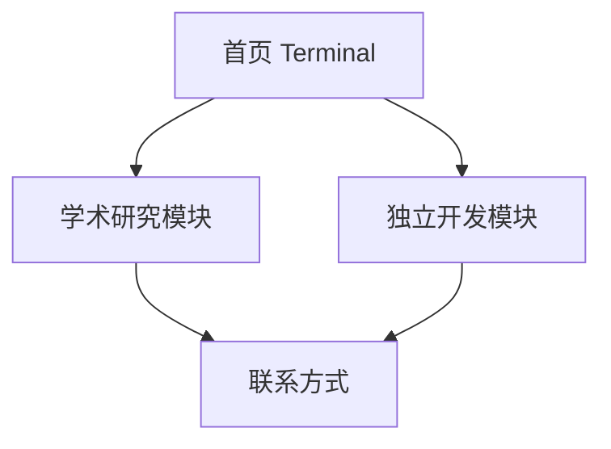

## 1. Product Overview
Axis Wang个人主页是一个采用极简主义和极客风格的终端风格个人网站。采用黑色背景配绿色符号的经典终端配色，专注展示学术研究和独立开发两大核心领域，体现技术极客的专业形象。

## 2. Core Features

### 2.1 User Roles
本项目为静态展示网站，无需用户注册和角色区分。

### 2.2 Feature Module
我们的个人主页采用极简结构，包含以下主要页面：
1. **首页**: 终端风格个人介绍、简洁导航
2. **学术研究**: 研究方向、学术成果、论文专利统一展示
3. **独立开发**: 个人产品、技术栈、开发经历集中展示

### 2.3 Page Details

| Page Name | Module Name | Feature description |
|-----------|-------------|---------------------|
| 首页 | Terminal Header | 终端风格个人信息展示，包含姓名、身份、位置信息，使用等宽字体和绿色文字 |
| 首页 | Navigation Menu | 极简导航菜单，仅包含"学术研究"和"独立开发"两个主要入口 |
| 首页 | Status Display | 当前状态显示，如在线状态、最近更新等，模拟终端状态栏 |
| 学术研究页面 | Research Areas | 研究方向列表展示：浮式风力发电机、计算流体力学 |
| 学术研究页面 | Publications | 期刊论文、专利、软件著作权的统一列表展示 |
| 学术研究页面 | Technical Skills | 学术相关技术栈：CFD、数值计算、高性能计算等 |
| 独立开发页面 | Product List | 个人产品列表：AI4Papers、Video2PPT、View-Pair等 |
| 独立开发页面 | Tech Stack | 开发技术栈：全栈开发、移动端、AI等技术展示 |
| 独立开发页面 | Contact Info | 联系方式和社交链接，终端风格展示 |

## 3. Core Process

极简化访问者浏览流程：
1. 访问者进入首页，通过终端风格界面快速了解身份信息
2. 选择"学术研究"或"独立开发"两个主要模块之一
3. 在选定模块内浏览相关内容和成果
4. 通过页面底部联系信息进行进一步交流

## 4. User Interface Design

### 4.1 Design Style
- 主色调：纯黑色背景 (#000000) 和绿色文字 (#00ff00)
- 辅助色：深绿色 (#008000) 和灰绿色 (#404040)
- 按钮样式：无边框极简风格，下划线悬停效果
- 字体：等宽字体 Fira Code 或 JetBrains Mono
- 布局风格：终端风格，左对齐文本布局
- 图标风格：ASCII字符和简单符号，避免复杂图标

### 4.2 Page Design Overview

| Page Name | Module Name | UI Elements |
|-----------|-------------|-------------|
| 首页 | Terminal Header | 纯文本信息展示、绿色等宽字体、无装饰元素 |
| 首页 | Navigation Menu | 简单文本链接、下划线分隔、无背景色 |
| 学术研究页面 | Research Areas | 列表式布局、ASCII符号标记、纯文本描述 |
| 学术研究页面 | Publications | 表格式展示、等宽字体、绿色高亮关键信息 |
| 独立开发页面 | Product List | 垂直列表、项目符号、链接用不同绿色标识 |
| 独立开发页面 | Tech Stack | 标签式文本展示、逗号分隔、无视觉装饰 |

### 4.3 Responsiveness
移动端优先的极简响应式设计，保持终端风格在所有设备上的一致性，文字大小和行距自适应屏幕尺寸，无复杂动画确保快速加载。