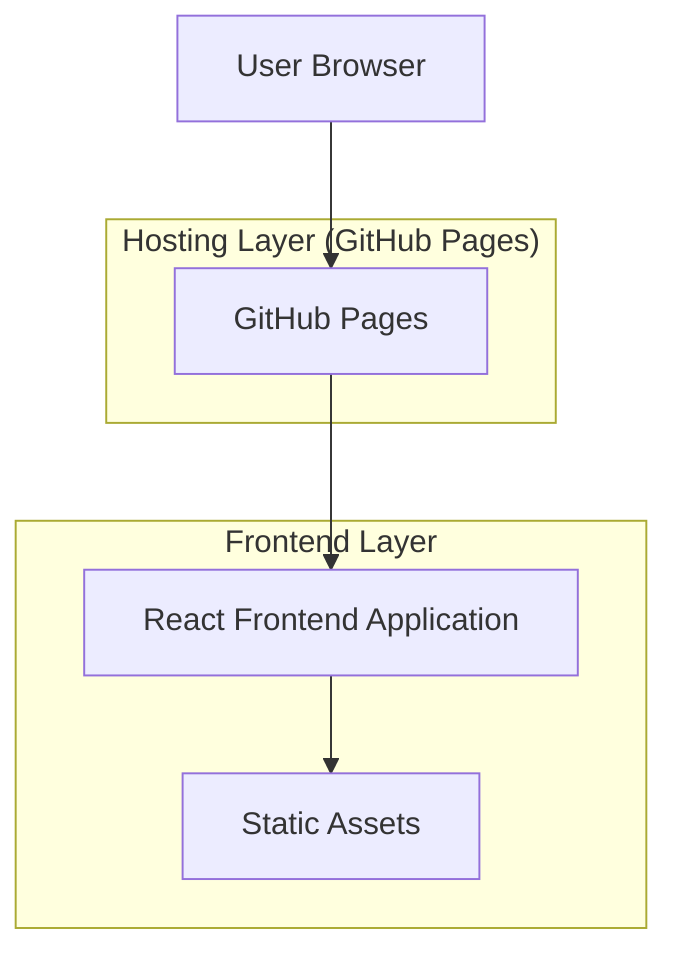

## 1. Architecture design



## 2. Technology Description

- Frontend: React@18 + TypeScript + Tailwind CSS@3 + Vite
- Hosting: GitHub Pages
- Build Tool: Vite with GitHub Actions
- Fonts: Fira Code / JetBrains Mono (等宽字体)
- Styling: 纯CSS实现终端风格，无复杂动画库

## 3. Route definitions

| Route | Purpose |
|-------|---------|
| / | 首页，终端风格个人信息展示和导航 |
| /research | 学术研究模块，统一展示研究方向、论文、专利等 |
| /development | 独立开发模块，展示个人产品、技术栈、联系方式 |

## 4. API definitions

本项目为纯静态网站，无需后端API。所有数据通过静态JSON文件或组件内部数据管理。

## 5. Data model

### 5.1 Data model definition

本项目为静态网站，无需数据库。数据通过TypeScript接口定义和静态文件管理。

主要数据结构：

```typescript
// 个人信息
interface PersonalInfo {
  name: string;
  title: string;
  location: string;
  description: string;
  avatar: string;
  social: SocialLink[];
}

// 研究领域
interface ResearchArea {
  id: string;
  title: string;
  description: string;
  technologies: string[];
  icon: string;
}

// 产品信息
interface Product {
  id: string;
  name: string;
  description: string;
  technologies: string[];
  link?: string;
  image?: string;
  status: 'active' | 'development' | 'archived';
}

// 学术成果
interface Publication {
  id: string;
  title: string;
  authors: string[];
  journal: string;
  year: number;
  type: 'journal' | 'patent' | 'software';
  link?: string;
}

// 技能
interface Skill {
  name: string;
  category: 'frontend' | 'backend' | 'tools' | 'research';
  level: number; // 1-5
}

// 获奖经历
interface Award {
  id: string;
  title: string;
  organization: string;
  year: number;
  description: string;
}
```

### 5.2 Static Data Files

数据将存储在以下静态文件中：

```
src/data/
├── personal.json          # 个人基本信息
├── research.json          # 研究领域数据
├── products.json          # 产品展示数据
├── publications.json      # 学术成果数据
├── skills.json           # 技能数据
└── awards.json           # 获奖经历数据
```

项目部署通过GitHub Actions自动构建并发布到GitHub Pages，支持自定义域名配置。